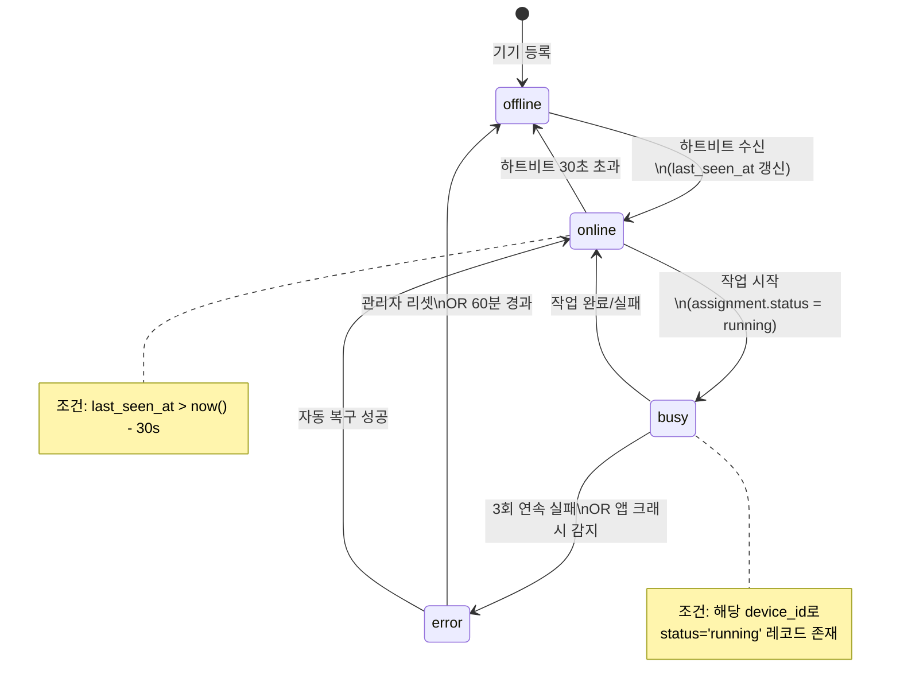
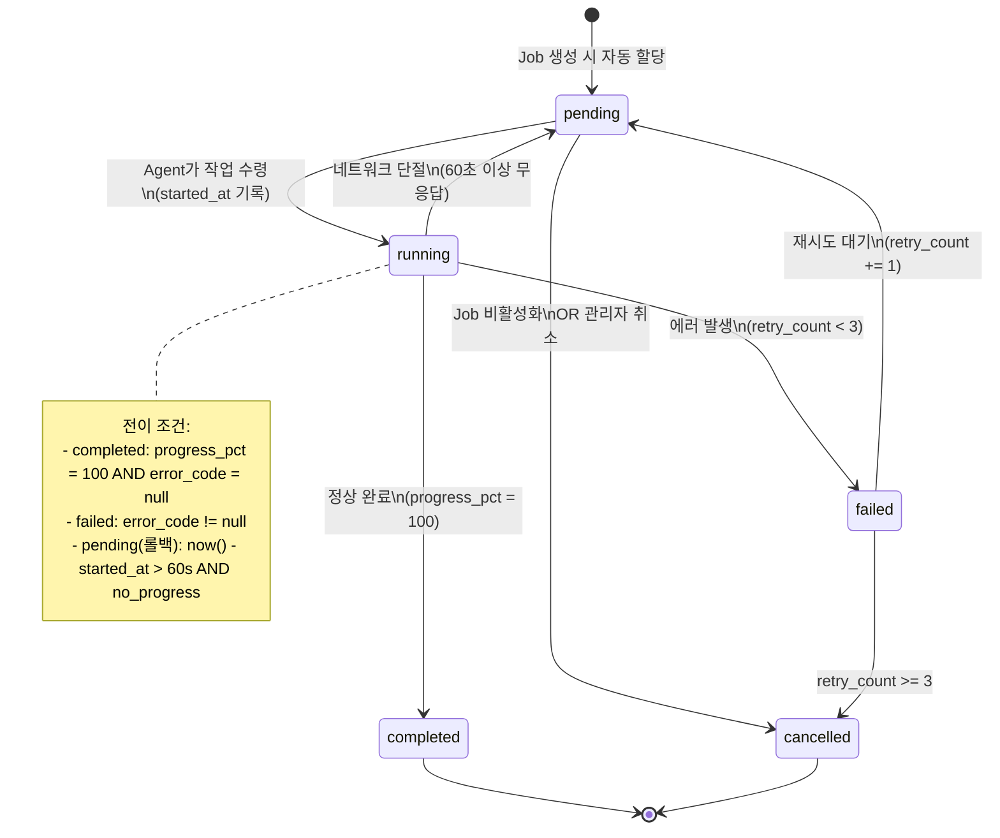
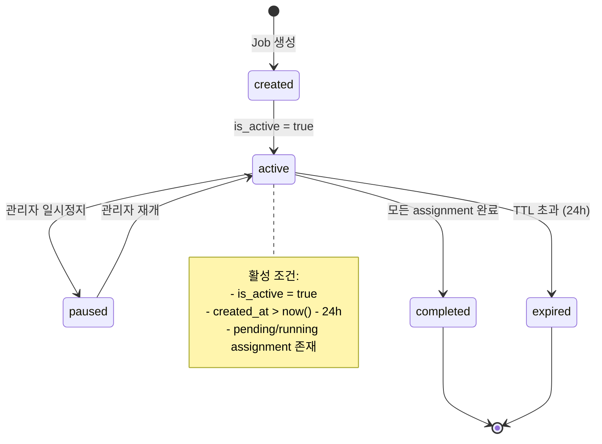
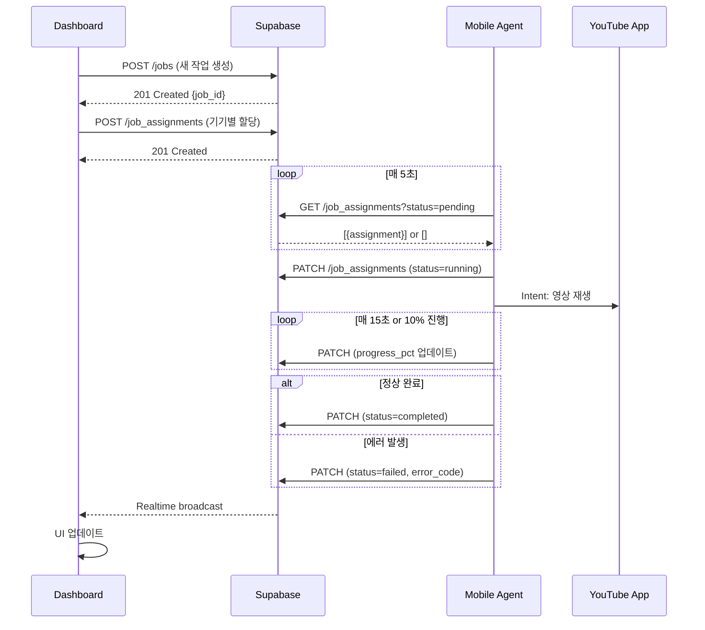

# DoAi.Me 시스템 분석 명세서

> 작성일: 2026-01-29
> 작성자: Claude (System Analyst)
> 버전: 1.0

## 1. 시스템 개요

```
┌─────────────────────────────────────────────────────────────────┐
│                      DoAi.Me Device Farm                        │
├─────────────────────────────────────────────────────────────────┤
│  Dashboard (Next.js)  ←→  Supabase  ←→  Mobile Agent (AutoX.js) │
└─────────────────────────────────────────────────────────────────┘
```

---

## 2. 데이터 스키마 (JSON Schema)

### 2.1 Device 스키마

```json
{
  "$schema": "http://json-schema.org/draft-07/schema#",
  "title": "Device",
  "type": "object",
  "required": ["id", "serial_number", "group_id", "pc_id"],
  "properties": {
    "id": {
      "type": "string",
      "format": "uuid",
      "description": "기기 고유 식별자 (PK)"
    },
    "serial_number": {
      "type": "string",
      "pattern": "^[A-Z0-9]{8,32}$",
      "description": "안드로이드 기기 시리얼 번호"
    },
    "group_id": {
      "type": "string",
      "pattern": "^P[0-9]+-G[0-9]+$",
      "description": "소속 그룹 (예: P1-G1)"
    },
    "pc_id": {
      "type": "string",
      "description": "연결된 PC 식별자"
    },
    "status": {
      "type": "string",
      "enum": ["online", "offline", "busy", "error"],
      "default": "offline"
    },
    "last_seen_at": {
      "type": "string",
      "format": "date-time",
      "description": "마지막 하트비트 시각"
    },
    "created_at": {
      "type": "string",
      "format": "date-time"
    }
  }
}
```

### 2.2 Job 스키마

```json
{
  "$schema": "http://json-schema.org/draft-07/schema#",
  "title": "Job",
  "type": "object",
  "required": ["id", "target_url", "script_type"],
  "properties": {
    "id": {
      "type": "string",
      "format": "uuid"
    },
    "title": {
      "type": "string",
      "maxLength": 200
    },
    "target_url": {
      "type": "string",
      "format": "uri",
      "pattern": "^https?://(www\\.)?(youtube\\.com|youtu\\.be)/.+"
    },
    "script_type": {
      "type": "string",
      "enum": ["youtube_watch", "youtube_shorts", "youtube_subscribe"],
      "default": "youtube_watch"
    },
    "duration_min_pct": {
      "type": "integer",
      "minimum": 10,
      "maximum": 100,
      "default": 30
    },
    "duration_max_pct": {
      "type": "integer",
      "minimum": 10,
      "maximum": 100,
      "default": 90
    },
    "prob_like": {
      "type": "integer",
      "minimum": 0,
      "maximum": 100,
      "default": 50
    },
    "prob_comment": {
      "type": "integer",
      "minimum": 0,
      "maximum": 100,
      "default": 30
    },
    "prob_playlist": {
      "type": "integer",
      "minimum": 0,
      "maximum": 100,
      "default": 10
    },
    "is_active": {
      "type": "boolean",
      "default": true
    },
    "base_reward": {
      "type": "number",
      "minimum": 0,
      "default": 10
    },
    "created_at": {
      "type": "string",
      "format": "date-time"
    }
  },
  "additionalProperties": false
}
```

### 2.3 JobAssignment 스키마

```json
{
  "$schema": "http://json-schema.org/draft-07/schema#",
  "title": "JobAssignment",
  "type": "object",
  "required": ["id", "job_id", "device_id", "status"],
  "properties": {
    "id": {
      "type": "string",
      "format": "uuid"
    },
    "job_id": {
      "type": "string",
      "format": "uuid",
      "description": "FK → jobs.id"
    },
    "device_id": {
      "type": "string",
      "format": "uuid",
      "description": "FK → devices.id"
    },
    "status": {
      "type": "string",
      "enum": ["pending", "running", "completed", "failed", "cancelled"],
      "default": "pending"
    },
    "progress_pct": {
      "type": "integer",
      "minimum": 0,
      "maximum": 100,
      "default": 0
    },
    "actual_duration_sec": {
      "type": ["integer", "null"],
      "minimum": 0,
      "description": "실제 시청 시간 (초)"
    },
    "did_like": {
      "type": "boolean",
      "default": false
    },
    "did_comment": {
      "type": "boolean",
      "default": false
    },
    "did_playlist": {
      "type": "boolean",
      "default": false
    },
    "error_code": {
      "type": ["string", "null"],
      "description": "실패 시 에러 코드"
    },
    "error_message": {
      "type": ["string", "null"],
      "description": "실패 시 상세 메시지"
    },
    "retry_count": {
      "type": "integer",
      "minimum": 0,
      "maximum": 3,
      "default": 0
    },
    "assigned_at": {
      "type": "string",
      "format": "date-time"
    },
    "started_at": {
      "type": ["string", "null"],
      "format": "date-time"
    },
    "completed_at": {
      "type": ["string", "null"],
      "format": "date-time"
    }
  }
}
```

---

## 3. 상태 머신 (State Machine)

### 3.1 Device 상태 전이



### 3.2 JobAssignment 상태 전이



### 3.3 Job 생명주기



---

## 4. 인터페이스 명세

### 4.1 Dashboard → Supabase (Job 생성)

```yaml
Interface: CreateJob
Method: POST (Supabase RPC 또는 Insert)
Endpoint: /rest/v1/jobs

Request:
  Headers:
    Authorization: "Bearer {SUPABASE_ANON_KEY}"
    Content-Type: "application/json"
    Prefer: "return=representation"

  Body:
    title: string (optional, max 200)
    target_url: string (required, YouTube URL)
    script_type: "youtube_watch" | "youtube_shorts" | "youtube_subscribe"
    duration_min_pct: integer (10-100)
    duration_max_pct: integer (10-100, >= duration_min_pct)
    prob_like: integer (0-100)
    prob_comment: integer (0-100)
    prob_playlist: integer (0-100)
    is_active: boolean (default: true)
    base_reward: number (default: 10)

Response:
  Success (201):
    {
      "id": "uuid",
      "title": "string",
      "target_url": "string",
      "created_at": "ISO8601"
    }

  Error (400):
    {
      "code": "VALIDATION_ERROR",
      "message": "duration_max_pct must be >= duration_min_pct",
      "details": { "field": "duration_max_pct", "value": 20 }
    }

  Error (401):
    { "code": "UNAUTHORIZED", "message": "Invalid API key" }
```

### 4.2 Mobile Agent → Supabase (Polling)

```yaml
Interface: PollAssignment
Method: GET (Supabase Select)
Endpoint: /rest/v1/job_assignments

Query:
  select: "*,jobs(*)"
  device_id: "eq.{DEVICE_UUID}"
  status: "eq.pending"
  order: "assigned_at.asc"
  limit: 1

Request:
  Headers:
    Authorization: "Bearer {SUPABASE_ANON_KEY}"
    apikey: "{SUPABASE_ANON_KEY}"

Response:
  Found (200):
    [{
      "id": "uuid",
      "job_id": "uuid",
      "status": "pending",
      "jobs": {
        "target_url": "https://youtu.be/xxx",
        "duration_min_pct": 30,
        "duration_max_pct": 90,
        "prob_like": 50,
        "prob_comment": 30,
        "prob_playlist": 10
      }
    }]

  Empty (200):
    []

Polling Interval: 5000ms
Backoff Strategy:
  - 기본: 5초
  - 빈 응답 3회 연속: 10초
  - 빈 응답 10회 연속: 30초
  - 에러 발생: exponential backoff (5s → 10s → 20s → 40s → 60s max)
```

### 4.3 Mobile Agent → Supabase (상태 업데이트)

```yaml
Interface: UpdateAssignmentProgress
Method: PATCH
Endpoint: /rest/v1/job_assignments?id=eq.{ASSIGNMENT_ID}

Request:
  Headers:
    Authorization: "Bearer {SUPABASE_ANON_KEY}"
    Content-Type: "application/json"
    Prefer: "return=minimal"

  Body (진행 중):
    {
      "status": "running",
      "progress_pct": 45,
      "started_at": "2024-01-29T10:30:00Z"  # 최초 업데이트 시에만
    }

  Body (완료):
    {
      "status": "completed",
      "progress_pct": 100,
      "actual_duration_sec": 156,
      "did_like": true,
      "did_comment": false,
      "did_playlist": false,
      "completed_at": "2024-01-29T10:35:36Z"
    }

  Body (실패):
    {
      "status": "failed",
      "error_code": "VIDEO_UNAVAILABLE",
      "error_message": "This video is not available in your country",
      "retry_count": 1
    }

Response:
  Success (204): No Content
  Error (404): { "code": "NOT_FOUND", "message": "Assignment not found" }
  Error (409): { "code": "CONFLICT", "message": "Assignment already completed" }

Update Frequency:
  - progress_pct: 10% 변화마다 OR 최소 15초 간격
  - 완료/실패: 즉시
```

### 4.4 Heartbeat 인터페이스

```yaml
Interface: DeviceHeartbeat
Method: PATCH
Endpoint: /rest/v1/devices?serial_number=eq.{SERIAL}

Request:
  Body:
    {
      "last_seen_at": "2024-01-29T10:30:00Z",
      "status": "online"  # OR "busy" if running
    }

Response:
  Success (204): No Content
  Not Found (404): 기기 미등록

Interval: 10초
Timeout Detection:
  Dashboard에서 last_seen_at < now() - 30s 시 "offline" 표시
```

---

## 5. 예외 처리 정책

### 5.1 네트워크 단절

```
IF Agent → Supabase 연결 실패:
  THEN
    1. 현재 작업 상태 로컬 저장 (SQLite/SharedPreferences)
    2. exponential backoff 재시도 (5s, 10s, 20s, 40s, 60s max)
    3. 5분 이상 연결 불가:
       - 현재 작업 일시중지 (로컬에서 progress 유지)
       - 10초마다 연결 재시도 지속
    4. 연결 복구 시:
       - 로컬 저장된 progress 동기화
       - IF assignment.status가 서버에서 'pending'으로 롤백됨:
         THEN 처음부터 재시작
       - ELSE 저장된 지점부터 재개
```

### 5.2 YouTube 앱 크래시

```
IF YouTube 앱 비정상 종료 감지:
  THEN
    1. error_code = "APP_CRASH" 기록
    2. retry_count += 1
    3. IF retry_count < 3:
       THEN
         - 5초 대기
         - YouTube 앱 강제 종료 (am force-stop)
         - 캐시 정리 (선택적)
         - 작업 재시작 (progress = 0)
       ELSE
         - status = "failed"
         - error_message = "YouTube app crashed 3 times consecutively"
         - 해당 기기 30분간 새 작업 할당 제외 (device.status = "error")

크래시 감지 조건:
  - YouTube Activity가 예상치 않게 사라짐
  - 시스템 ANR 브로드캐스트 수신
  - 영상 진행이 60초 이상 정지 (progress 변화 없음)
```

### 5.3 영상 불가 (삭제/비공개/지역제한)

```
IF 영상 재생 불가:
  THEN
    1. 에러 유형 식별:
       - "VIDEO_UNAVAILABLE": 삭제/비공개
       - "VIDEO_REGION_BLOCKED": 지역 제한
       - "VIDEO_AGE_RESTRICTED": 연령 제한 (로그인 필요)
       - "VIDEO_NETWORK_ERROR": 일시적 네트워크 오류

    2. IF error_type IN ["VIDEO_UNAVAILABLE", "VIDEO_REGION_BLOCKED"]:
       THEN
         - status = "failed"
         - 재시도 없이 즉시 실패 처리
         - Job.is_active = false (모든 기기에 영향)

    3. IF error_type = "VIDEO_AGE_RESTRICTED":
       THEN
         - 해당 기기에서만 실패 처리
         - 연령 인증된 계정 가진 기기에 재할당

    4. IF error_type = "VIDEO_NETWORK_ERROR":
       THEN
         - retry_count += 1
         - 10초 후 재시도
         - 3회 실패 시 failed 처리
```

### 5.4 진행률 교착 상태 (Deadlock)

```
IF progress_pct 변화 없이 120초 경과:
  THEN
    1. 스크린 캡처 저장 (디버깅용)
    2. 현재 Activity 스택 확인

    3. IF 광고 재생 중 (AdView 감지):
       THEN
         - 정상 상태로 간주
         - 타이머 리셋
         - 광고 종료 대기 (최대 5분)

    4. IF 팝업/다이얼로그 존재:
       THEN
         - 닫기 버튼 탐색 및 클릭
         - 뒤로가기 시도
         - 타이머 리셋

    5. IF 위 조건 모두 아님:
       THEN
         - error_code = "PLAYBACK_STALLED"
         - YouTube 앱 재시작 후 재시도
         - retry_count += 1
```

### 5.5 Supabase Rate Limit

```
IF HTTP 429 (Too Many Requests) 수신:
  THEN
    1. Retry-After 헤더 확인
    2. IF Retry-After 존재:
       THEN 해당 시간만큼 대기
       ELSE 60초 대기
    3. 재시도
    4. 3회 연속 429:
       - 해당 기기 5분간 요청 중단
       - 대시보드에 알림 (Realtime broadcast)
```

### 5.6 중복 할당 방지

```
IF 동일 device_id + job_id 조합으로 중복 assignment 시도:
  THEN
    1. Supabase UNIQUE constraint 위반 (23505)
    2. 기존 assignment 상태 확인
    3. IF 기존 status = "pending":
       THEN 기존 assignment 사용
    4. IF 기존 status = "completed":
       THEN 새 assignment 생성 차단 (이미 완료)
    5. IF 기존 status = "failed" AND retry_count < 3:
       THEN 기존 assignment를 pending으로 리셋
```

---

## 6. 데이터 정합성 규칙

| 규칙 ID | 설명 | 검증 시점 |
|---------|------|-----------|
| V001 | `duration_max_pct >= duration_min_pct` | Job 생성 시 |
| V002 | `prob_like + prob_comment + prob_playlist <= 300` | Job 생성 시 (각각 최대 100) |
| V003 | Assignment는 반드시 존재하는 Job과 Device 참조 | FK 제약 |
| V004 | `completed_at`은 `started_at` 이후여야 함 | Assignment 완료 시 |
| V005 | `actual_duration_sec > 0` (완료 시) | Assignment 완료 시 |
| V006 | 하나의 Device는 동시에 1개의 running assignment만 허용 | Assignment 시작 시 |
| V007 | `retry_count`는 3 초과 불가 | Assignment 업데이트 시 |

---

## 7. 에러 코드 체계

| 코드 | 범주 | 설명 | 재시도 가능 |
|------|------|------|-------------|
| `E1001` | Network | Supabase 연결 실패 | Yes (exponential) |
| `E1002` | Network | 요청 타임아웃 (30초) | Yes (3회) |
| `E1003` | Network | Rate limit 초과 | Yes (대기 후) |
| `E2001` | YouTube | 영상 삭제/비공개 | No |
| `E2002` | YouTube | 지역 제한 | No |
| `E2003` | YouTube | 연령 제한 | No (기기 변경) |
| `E2004` | YouTube | 재생 오류 | Yes (3회) |
| `E3001` | Device | 앱 크래시 | Yes (3회) |
| `E3002` | Device | 메모리 부족 | No (기기 리셋 필요) |
| `E3003` | Device | 화면 잠금 | Yes (잠금 해제 후) |
| `E3004` | Device | 배터리 부족 (<5%) | No (충전 필요) |
| `E4001` | System | 알 수 없는 오류 | Yes (1회) |

---

## 8. 시퀀스 다이어그램

### 8.1 작업 생성 및 실행 흐름



---

## 변경 이력

| 버전 | 날짜 | 변경 내용 |
|------|------|-----------|
| 1.0 | 2026-01-29 | 초안 작성 |
