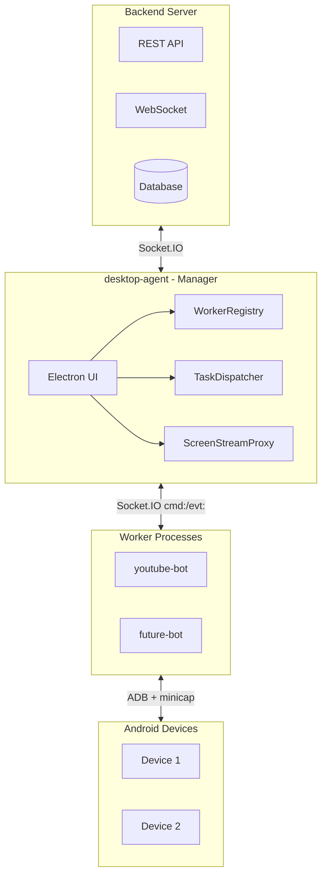
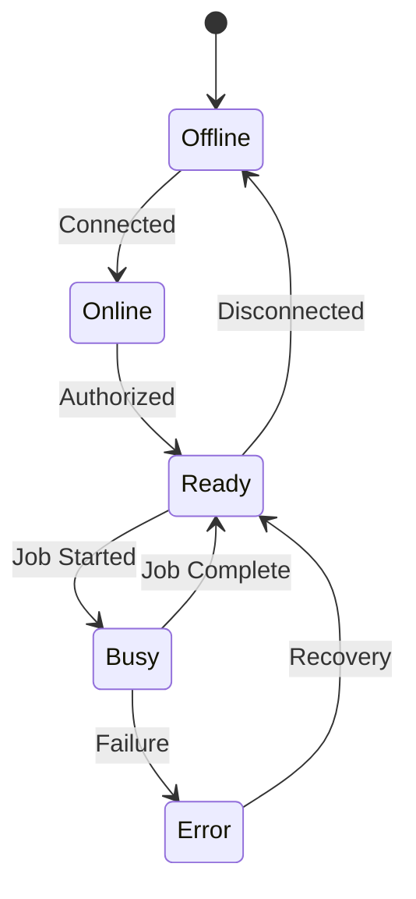
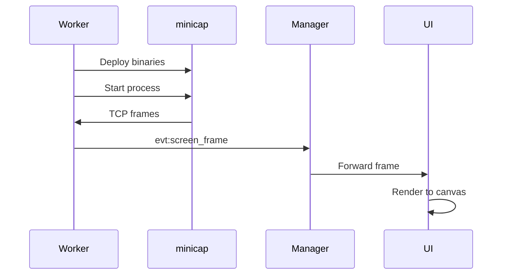

# Manager-Worker Architecture

## Overview

The Manager-Worker architecture separates orchestration concerns from execution logic. The **Manager** (`desktop-agent`) handles all coordination, UI, and device management, while **Workers** (e.g., `youtube-bot`) focus solely on executing specific automation tasks.

### Why This Architecture?

1. **Separation of Concerns**: Clean boundary between coordination and execution
2. **Scalability**: Multiple workers can connect to a single manager
3. **Flexibility**: New worker types can be added without modifying the manager
4. **Resilience**: Worker failures don't crash the entire system
5. **Resource Efficiency**: Workers run only the components they need

## Architecture Diagram



## Packages

### @doai/worker-types

Location: `packages/worker-types/`

Defines the communication contract between Manager and Workers:

- **Socket.IO Events**: `ManagerToWorkerEvents`, `WorkerToManagerEvents`
- **Worker Types**: `WorkerInterface`, `JobHandler`, `WorkerCapability`
- **Device Types**: `Device`, `DeviceState`, `DeviceCommand`
- **Streaming Types**: `MinicapFrame`, `StreamConfig`

### @doai/worker-core

Location: `packages/worker-core/`

Provides core functionality for building workers:

- **AdbController**: Robust ADB operations via `@devicefarmer/adbkit`
- **DeviceManager**: Device state management
- **BaseWorker**: Abstract base class for all workers
- **MinicapManager/Server**: Screen streaming infrastructure
- **Logger**: Structured logging

## Applications

### desktop-agent (Manager)

Location: `apps/desktop-agent/`

Responsibilities:
- Electron UI for monitoring and control
- Socket.IO connection to backend
- Worker registration and health monitoring (`WorkerRegistry`)
- Job dispatching to appropriate workers (`TaskDispatcher`)
- Screen stream aggregation (`ScreenStreamProxy`)

### youtube-bot (Worker)

Location: `apps/youtube-bot/`

Responsibilities:
- YouTube-specific automation
- Human simulation for natural interactions
- Job handlers: `WatchHandler`, future handlers for search, subscribe, etc.

## Communication Protocol

All communication follows the Command & Control pattern defined in `.cursor/rules/architecture-c2-pattern.mdc`.

### cmd:* Events (Manager → Worker)

| Event | Description |
|-------|-------------|
| `cmd:register_ack` | Acknowledge worker registration |
| `cmd:execute_job` | Start a job execution |
| `cmd:cancel_job` | Cancel a running job |
| `cmd:assign_device` | Assign a device to worker |
| `cmd:unassign_device` | Remove device from worker |
| `cmd:start_stream` | Start screen streaming |
| `cmd:stop_stream` | Stop screen streaming |

### evt:* Events (Worker → Manager)

| Event | Description |
|-------|-------------|
| `evt:heartbeat` | Periodic health check with status |
| `evt:register` | Worker registration request |
| `evt:job_started` | Job execution began |
| `evt:job_progress` | Job progress update |
| `evt:job_complete` | Job finished successfully |
| `evt:job_failed` | Job failed with error |
| `evt:screen_frame` | Screen capture frame |
| `evt:device_discovered` | New device found |
| `evt:device_disconnected` | Device disconnected |

## Device Management

### Discovery via adbkit

```typescript
// AdbController tracks devices
const controller = new AdbController();
controller.trackDevices({
  onAdd: (device) => console.log('New device:', device.id),
  onRemove: (id) => console.log('Device removed:', id),
  onChange: (device) => console.log('State changed:', device.id)
});
```

### Device States



## Screen Streaming (minicap)

### Overview

`minicap` provides high-performance screen capture at 30+ FPS compared to 1-2 FPS with standard ADB screencap.

### Binary Protocol

```
Frame Structure:
+-------------------+-------------------+
| Header (24 bytes) | JPEG Data         |
+-------------------+-------------------+

Header:
- version (1 byte)
- headerSize (1 byte)
- pid (4 bytes)
- realWidth (4 bytes)
- realHeight (4 bytes)
- virtualWidth (4 bytes)
- virtualHeight (4 bytes)
- orientation (1 byte)
- quirks (1 byte)
```

### Streaming Flow



## Adding New Workers

### Step 1: Create Worker Package

```bash
mkdir apps/my-new-bot
cd apps/my-new-bot
npm init -y
```

### Step 2: Define Job Handler

```typescript
// src/handlers/MyHandler.ts
import { JobHandler, JobContext, JobResult } from '@doai/worker-types';

export class MyHandler implements JobHandler {
  readonly jobType = 'my_job_type';
  readonly version = '1.0.0';

  validate(params: Record<string, unknown>): boolean | string {
    // Validate params
    return true;
  }

  async execute(context: JobContext): Promise<JobResult> {
    // Implementation
    return { success: true, data: {} };
  }

  async cancel(): Promise<void> {
    // Cleanup
  }
}
```

### Step 3: Create Worker Class

```typescript
// src/MyWorker.ts
import { BaseWorker } from '@doai/worker-core';
import { WorkerType, WorkerCapability } from '@doai/worker-types';
import { MyHandler } from './handlers/MyHandler';

export class MyWorker extends BaseWorker {
  readonly type: WorkerType = 'my_worker';
  readonly capabilities: WorkerCapability[] = ['automation'];

  constructor(config: WorkerConfig) {
    super(config);
    this.registerJobHandler(new MyHandler(this.adbController));
  }
}
```

### Step 4: Create Entry Point

```typescript
// src/index.ts
import { MyWorker } from './MyWorker';

const worker = new MyWorker({
  workerId: process.env.WORKER_ID!,
  managerUrl: process.env.MANAGER_URL!,
});

worker.connect();
```

## Running the System

### Start Manager

```bash
cd apps/desktop-agent
npm run dev
```

### Start Worker

```bash
cd apps/youtube-bot
WORKER_ID=youtube-1 MANAGER_URL=http://localhost:3001 npm start
```

### Environment Variables

| Variable | Description | Default |
|----------|-------------|---------|
| `WORKER_ID` | Unique worker identifier | Required |
| `MANAGER_URL` | Manager Socket.IO URL | Required |
| `ADB_HOST` | ADB server host | `localhost` |
| `ADB_PORT` | ADB server port | `5037` |
| `LOG_LEVEL` | Logging verbosity | `info` |
| `HEARTBEAT_INTERVAL` | Health check interval (ms) | `5000` |
