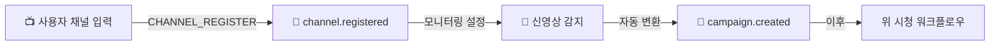
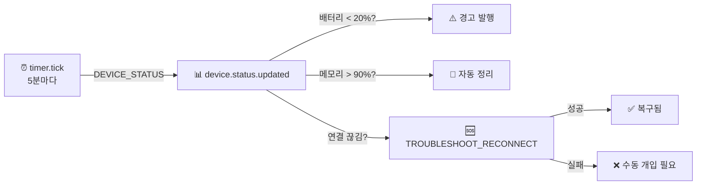

# 봇 카탈로그 (Bot Catalog)

**Document Version**: 1.0.0
**Last Updated**: 2026-02-07
**Status**: Active

---

## 1. 개요 (Overview)

DoAi.Me Device Farm의 봇 시스템은 **Bot Registry Pattern**을 기반으로 동작합니다. 백엔드에서 `GET /bots/registry` API를 통해 등록된 봇 정의를 노출하고, Electron 클라이언트(`desktop-agent`)가 이를 동적으로 렌더링합니다.

### 핵심 특징

| 특징 | 설명 |
|-----|------|
| **Registry Pattern** | Backend에서 `GET /bots/registry` 제공 → Client가 동적 렌더링 |
| **Dynamic Discovery** | 레지스트리에 새 봇을 추가하면 클라이언트 재시작 불필요 |
| **Fallback Support** | 백엔드 미응답 시 내장 봇 목록 사용 |
| **Zero-Touch Deployment** | 새 봇 배포 후 자동으로 UI에 표시 |
| **Worker Pattern** | 각 봇은 독립적 Worker 프로세스로 실행 |

### 아키텍처 다이어그램

```
┌────────────────────────────────────┐
│      Backend Server                │
│  GET /bots/registry → []           │
│  (BotDefinition list)              │
└────────────────┬───────────────────┘
                 │
                 │ Socket.IO
                 │ (정기 동기화)
                 ▼
┌────────────────────────────────────┐
│    Desktop-Agent (Electron)        │
│  - 봇 레지스트리 캐시              │
│  - 동적 UI 렌더링                  │
│  - Manager 역할                    │
└────────────┬───────────────────────┘
             │
             │ Socket.IO (cmd:*, evt:*)
             │
    ┌────────┴────────────┐
    ▼                     ▼
┌─────────────┐      ┌──────────────┐
│ YouTube-Bot │      │  Health-Bot  │
│  (Worker)   │      │  (Worker)    │
└─────────────┘      └──────────────┘
    │                     │
    └─────────────┬───────┘
                  │ ADB
                  ▼
         ┌─────────────────┐
         │ Android Devices │
         └─────────────────┘
```

---

## 2. BotDefinition 스키마

모든 봇은 다음 `BotDefinition` 타입으로 정의됩니다.

### 타입 정의

```typescript
type BotDefinition = {
  // 고유 식별자 (e.g., "VIDEO_REGISTER", "YOUTUBE_WATCH")
  key: string;

  // 한국어 봇 이름 (e.g., "영상등록 봇", "시청 봇")
  nameKo: string;

  // 한국어 설명
  descriptionKo: string;

  // 봇 분류 (아래 카테고리 참조)
  category: "VIDEO" | "CHANNEL" | "DEVICE" | "INFRA" | "TROUBLESHOOTING";

  // 봇이 사용하는 기술/기능 (e.g., ["adb", "uiautomator2", "appium", "scrcpy"])
  capabilities: string[];

  // 이 봇이 처리하는 이벤트 타입 (e.g., ["user.input", "watch.prepared"])
  inputs: string[];

  // 이 봇이 발생시키는 이벤트 타입 (e.g., ["campaign.created", "watch.started"])
  outputs: string[];

  // 멱등성(Idempotency) 판단 키 (e.g., ["videoId"], ["campaignId", "deviceId"])
  // 같은 키로 요청이 들어오면 중복 실행하지 않음
  idempotencyKeys: string[];

  // 재시도 정책
  retryPolicy: {
    maxRetries: number;                    // 최대 재시도 횟수
    backoffMs: number[];                   // 각 재시도 간 대기 시간 (ms)
                                          // 길이 = maxRetries
  };
};
```

### 예시

```typescript
// 영상등록 봇
const VIDEO_REGISTER: BotDefinition = {
  key: "VIDEO_REGISTER",
  nameKo: "영상등록 봇",
  descriptionKo: "YouTube URL을 정규화하고 캠페인을 생성합니다.",
  category: "VIDEO",
  capabilities: [],  // Backend 작업이므로 외부 도구 불필요
  inputs: ["user.input"],
  outputs: ["campaign.created"],
  idempotencyKeys: ["videoId"],
  retryPolicy: {
    maxRetries: 3,
    backoffMs: [1000, 3000, 10000]  // 1s, 3s, 10s
  }
};

// 시청 봇
const VIDEO_WATCH: BotDefinition = {
  key: "VIDEO_WATCH",
  nameKo: "영상시청 봇",
  descriptionKo: "영상을 재생하고 시청 시간을 관리합니다.",
  category: "VIDEO",
  capabilities: ["adb", "uiautomator2", "scrcpy"],
  inputs: ["watch.ready"],
  outputs: ["watch.started", "watch.progress", "watch.ended"],
  idempotencyKeys: ["watchId"],
  retryPolicy: {
    maxRetries: 2,
    backoffMs: [3000, 10000]
  }
};
```

---

## 3. 등록된 봇 목록

### 3.1 영상/캠페인 관련 봇 (VIDEO/CHANNEL Category)

#### 1. VIDEO_REGISTER - 영상등록 봇

| 항목 | 값 |
|-----|-----|
| **nameKo** | 영상등록 봇 |
| **descriptionKo** | YouTube URL을 정규화하고 캠페인을 생성합니다. |
| **category** | VIDEO |
| **capabilities** | `[]` (Backend API 호출) |
| **inputs** | `["user.input"]` |
| **outputs** | `["campaign.created"]` |
| **idempotencyKeys** | `["videoId"]` |
| **retryPolicy** | `{maxRetries: 3, backoffMs: [1000, 3000, 10000]}` |

**역할**:
- YouTube URL 정규화 (short URL → full URL)
- 영상 메타데이터 추출
- 캠페인 DB 레코드 생성
- 초기 상태: `PENDING`

**예시 이벤트**:
```typescript
// INPUT
{
  "type": "user.input",
  "data": {
    "action": "register_video",
    "youtubeUrl": "https://youtu.be/dQw4w9WgXcQ"
  }
}

// OUTPUT
{
  "type": "campaign.created",
  "data": {
    "campaignId": "camp_123abc",
    "videoId": "dQw4w9WgXcQ",
    "title": "...",
    "duration": 212,
    "status": "PENDING"
  }
}
```

---

#### 2. CHANNEL_REGISTER - 채널등록 봇

| 항목 | 값 |
|-----|-----|
| **nameKo** | 채널등록 봇 |
| **descriptionKo** | 채널을 시스템에 등록하고 영상 모니터링을 설정합니다. |
| **category** | CHANNEL |
| **capabilities** | `[]` |
| **inputs** | `["user.input"]` |
| **outputs** | `["channel.registered"]` |
| **idempotencyKeys** | `["channelHandle"]` |
| **retryPolicy** | `{maxRetries: 3, backoffMs: [1000, 3000, 10000]}` |

**역할**:
- YouTube 채널 URL 정규화
- 채널 메타데이터 저장
- 구독자 수, 영상 개수 등 통계 기록
- 모니터링 설정 (신영상 발행 감지)

---

#### 3. KEYWORD - 키워드 추출 봇

| 항목 | 값 |
|-----|-----|
| **nameKo** | 키워드 봇 |
| **descriptionKo** | 캠페인 제목/설명에서 검색 키워드를 추출하거나 수동으로 관리합니다. |
| **category** | VIDEO |
| **capabilities** | `[]` |
| **inputs** | `["campaign.created"]` |
| **outputs** | `["video.search.requested"]` |
| **idempotencyKeys** | `["campaignId"]` |
| **retryPolicy** | `{maxRetries: 3, backoffMs: [1000, 3000, 10000]}` |

**역할**:
- 캠페인 제목에서 자동 키워드 추출 (NLP)
- 수동 키워드 입력 지원
- 키워드 기반 검색 이벤트 발행

---

### 3.2 검색/시청 자동화 봇 (VIDEO Category - Device 작업)

#### 4. VIDEO_SEARCH - 영상검색 봇

| 항목 | 값 |
|-----|-----|
| **nameKo** | 영상검색 봇 |
| **descriptionKo** | 지정된 키워드로 YouTube에서 영상을 검색합니다. |
| **category** | VIDEO |
| **capabilities** | `["adb", "uiautomator2"]` |
| **inputs** | `["video.search.requested"]` |
| **outputs** | `["video.search.completed", "search.result"]` |
| **idempotencyKeys** | `["campaignId"]` |
| **retryPolicy** | `{maxRetries: 5, backoffMs: [2000, 5000, 15000, 30000, 60000]}` |

**역할**:
- 디바이스에 YouTube 앱 실행
- 검색창 탭하고 키워드 입력
- 검색 결과에서 목표 영상 찾기
- 영상 링크 추출 및 저장

**구현 방식**:
- `UIAutomator2`: 앱 UI 요소 탐색
- `ADB`: 장치 제어 (탭, 입력, 스크롤)

---

#### 5. WATCH_PREPARE - 시청준비 봇

| 항목 | 값 |
|-----|-----|
| **nameKo** | 시청준비 봇 |
| **descriptionKo** | 디바이스를 할당하고, 앱을 실행하며, YouTube에 접속 준비합니다. |
| **category** | VIDEO |
| **capabilities** | `["adb", "uiautomator2"]` |
| **inputs** | `["watch.prepare.requested"]` |
| **outputs** | `["watch.ready"]` |
| **idempotencyKeys** | `["watchId"]` |
| **retryPolicy** | `{maxRetries: 3, backoffMs: [2000, 5000, 15000]}` |

**역할**:
- 사용 가능한 디바이스 할당 (상태 확인)
- YouTube 앱 실행
- 로그인 상태 확인
- 영상 URL 입력 준비

---

#### 6. VIDEO_WATCH - 영상시청 봇

| 항목 | 값 |
|-----|-----|
| **nameKo** | 영상시청 봇 |
| **descriptionKo** | 영상을 재생하고 지정된 시간 동안 시청합니다. |
| **category** | VIDEO |
| **capabilities** | `["adb", "uiautomator2", "scrcpy"]` |
| **inputs** | `["watch.ready"]` |
| **outputs** | `["watch.started", "watch.progress", "watch.ended"]` |
| **idempotencyKeys** | `["watchId"]` |
| **retryPolicy** | `{maxRetries: 2, backoffMs: [3000, 10000]}` |

**역할**:
- 영상 URL 입력 및 재생
- 전체 영상 시청 또는 지정된 시간 시청
- 시청 진행도 이벤트 발행 (5초마다)
- 광고 감지 및 스킵 (자동/수동)
- Human-like 행동 시뮬레이션 (무작위 스크롤, 지연)

**구현 예시** (`@doai/youtube-bot`):

```typescript
// HumanSimulator 클래스 활용
const simulator = new HumanSimulator(adbController, {
  baseDelayMs: 1000,           // 기본 1초 지연
  delayVariance: 0.3,          // ±30% 분산
  likeProbability: 0.1,        // 10% 확률로 좋아요
  commentProbability: 0.02,    // 2% 확률로 댓글
  minScrollIntervalSec: 15,
  maxScrollIntervalSec: 45
});

// 시청 시뮬레이션
await simulator.simulateWatching(deviceSerial, 300); // 5분 시청
```

**출력 이벤트 예시**:
```typescript
// watch.started
{
  "type": "watch.started",
  "data": { "watchId": "w_123", "videoId": "xyz", "startedAt": "..." }
}

// watch.progress (매 5초)
{
  "type": "watch.progress",
  "data": { "watchId": "w_123", "elapsedSeconds": 5, "totalSeconds": 300 }
}

// watch.ended
{
  "type": "watch.ended",
  "data": { "watchId": "w_123", "watchedSeconds": 295, "status": "COMPLETED" }
}
```

---

#### 7. USER_ACTION - 유저액션 봇

| 항목 | 값 |
|-----|-----|
| **nameKo** | 유저액션 봇 |
| **descriptionKo** | 좋아요, 댓글, 구독, 저장, 쇼츠 만들기 등 상호작용을 수행합니다. |
| **category** | VIDEO |
| **capabilities** | `["uiautomator2", "adb"]` |
| **inputs** | `["action.requested"]` |
| **outputs** | `["action.performed"]` |
| **idempotencyKeys** | `["watchId", "actionType"]` |
| **retryPolicy** | `{maxRetries: 3, backoffMs: [1000, 3000, 10000]}` |

**지원하는 액션**:
- ✅ Like (좋아요)
- ✅ Comment (댓글)
- ✅ Subscribe (구독)
- ✅ Save (저장)
- ✅ Share (공유)
- 🔄 Create Shorts (쇼츠 만들기) - 미구현

**예시**:
```typescript
// INPUT
{
  "type": "action.requested",
  "data": {
    "watchId": "w_123",
    "actionType": "like"
  }
}

// OUTPUT
{
  "type": "action.performed",
  "data": {
    "watchId": "w_123",
    "actionType": "like",
    "success": true,
    "timestamp": "..."
  }
}
```

---

#### 8. VIDEO_END - 영상종료 봇

| 항목 | 값 |
|-----|-----|
| **nameKo** | 영상종료 봇 |
| **descriptionKo** | 시청 세션을 종료하고 리소스를 해제한 후 통계를 기록합니다. |
| **category** | VIDEO |
| **capabilities** | `["adb"]` |
| **inputs** | `["watch.ended"]` |
| **outputs** | `["log.event"]` |
| **idempotencyKeys** | `["watchId"]` |
| **retryPolicy** | `{maxRetries: 2, backoffMs: [1000, 5000]}` |

**역할**:
- YouTube 앱 종료
- 디바이스 상태 리셋 (캐시 정리 옵션)
- 통계 DB 저장
  - watchId, videoId, campaignId
  - watchedSeconds, actionsPerformed
  - startedAt, endedAt
  - deviceId, status

---

### 3.3 기기 관리 봇 (DEVICE Category)

#### 9. DEVICE_REGISTER - 기기등록 봇

| 항목 | 값 |
|-----|-----|
| **nameKo** | 기기등록 봇 |
| **descriptionKo** | 신규 디바이스를 시스템에 등록하고 메타데이터를 기록합니다. |
| **category** | DEVICE |
| **capabilities** | `["adb"]` |
| **inputs** | `["device.detected"]` |
| **outputs** | `["device.registered"]` |
| **idempotencyKeys** | `["deviceId"]` |
| **retryPolicy** | `{maxRetries: 3, backoffMs: [1000, 3000, 10000]}` |

**수집하는 정보**:
- Device ID (ADB serial)
- 기기 모델명 (e.g., "Samsung Galaxy A12")
- Android 버전
- RAM, Storage 정보
- YouTube 앱 설치 여부
- 권한 상태 (USB Debug, Storage, etc.)

---

#### 10. DEVICE_STATUS - 기기상태 봇

| 항목 | 값 |
|-----|-----|
| **nameKo** | 기기상태 봇 |
| **descriptionKo** | 주기적으로 또는 이벤트 기반으로 디바이스 상태를 업데이트합니다. |
| **category** | DEVICE |
| **capabilities** | `["adb"]` |
| **inputs** | `["timer.tick", "device.registered"]` |
| **outputs** | `["device.status.updated"]` |
| **idempotencyKeys** | `["deviceId", "statusUpdatedAt"]` |
| **retryPolicy** | `{maxRetries: 5, backoffMs: [1000, 2000, 5000, 10000, 30000]}` |

**모니터링 항목**:
- ✅ Battery Level (배터리 수준)
- ✅ Screen Status (화면 on/off)
- ✅ Memory Usage (메모리 사용률)
- ✅ Network Status (연결 상태)
- ✅ Storage Free Space (저장소 여유공간)
- ✅ YouTube App Status (앱 설치/버전)

**실행 주기**:
- 기본: 5분마다
- 상황: 비정상 상태 감지 시 1분마다

---

### 3.4 문제해결 봇 (TROUBLESHOOTING Category)

#### 11. TROUBLESHOOT_RECONNECT - 문제해결-재접속 봇

| 항목 | 값 |
|-----|-----|
| **nameKo** | 문제해결-재접속 봇 |
| **descriptionKo** | 연결 끊김, 권한 문제, 앱 크래시 등을 감지하고 복구합니다. |
| **category** | TROUBLESHOOTING |
| **capabilities** | `["adb", "uiautomator2"]` |
| **inputs** | `["troubleshoot.reconnect.requested", "device.disconnected"]` |
| **outputs** | `["troubleshoot.reconnect.completed"]` |
| **idempotencyKeys** | `["deviceId"]` |
| **retryPolicy** | `{maxRetries: 10, backoffMs: [1000, 2000, 5000, 10000, 30000, 60000, 120000]}` |

**복구 절차**:

```
1. ADB 연결 확인
   ├─ 연결 끊김 → ADB 재연결
   └─ 성공 → 다음 단계

2. USB Debug 권한 확인
   ├─ 거부됨 → 사용자 동의 유도 (수동)
   └─ 허용 → 다음 단계

3. YouTube 앱 상태 확인
   ├─ 설치 안 됨 → 설치
   ├─ 크래시 → 강제 종료 및 재실행
   └─ 정상 → 완료

4. 네트워크 확인
   ├─ 오프라인 → Wi-Fi/Mobile 재연결
   └─ 온라인 → 완료
```

**성공 조건**:
- ADB 연결 OK
- YouTube 앱 실행 가능
- 네트워크 통신 OK
- 스크린 켜짐 (또는 원격 제어 가능)

---

## 4. 워크플로우 파이프라인

### 4.1 표준 시청 워크플로우

```mermaid
graph LR
    A["👤 사용자 입력<br/>user.input"] -->|VIDEO_REGISTER| B["📱 campaign.created"]
    B -->|KEYWORD| C["🔍 video.search.requested"]
    C -->|VIDEO_SEARCH| D["📺 search.completed"]
    D -->|WATCH_PREPARE| E["⚙️ watch.ready"]
    E -->|VIDEO_WATCH| F["▶️ watch.started"]
    F -->|계속| G["📊 watch.progress"]
    G -->|계속| H["⏹️ watch.ended"]
    H -->|USER_ACTION| I["👍 action.performed"]
    I -->|VIDEO_END| J["📝 log.event"]
    J -->|저장| K["💾 통계 DB"]
```



### 4.2 채널 모니터링 워크플로우



### 4.3 기기 상태 모니터링



---

## 5. 레지스트리 확장 메커니즘

### 5.1 백엔드 레지스트리 API

#### 엔드포인트

```
GET /bots/registry
```

#### 응답

```typescript
{
  "status": "ok",
  "data": {
    "bots": BotDefinition[],
    "version": "1.0.0",
    "lastUpdated": "2026-02-07T10:30:00Z"
  }
}
```

#### 예시 응답

```json
{
  "status": "ok",
  "data": {
    "bots": [
      {
        "key": "VIDEO_REGISTER",
        "nameKo": "영상등록 봇",
        "descriptionKo": "YouTube URL을 정규화하고 캠페인을 생성합니다.",
        "category": "VIDEO",
        "capabilities": [],
        "inputs": ["user.input"],
        "outputs": ["campaign.created"],
        "idempotencyKeys": ["videoId"],
        "retryPolicy": {
          "maxRetries": 3,
          "backoffMs": [1000, 3000, 10000]
        }
      },
      {
        "key": "VIDEO_WATCH",
        "nameKo": "영상시청 봇",
        "descriptionKo": "영상을 재생하고 지정된 시간 동안 시청합니다.",
        "category": "VIDEO",
        "capabilities": ["adb", "uiautomator2", "scrcpy"],
        "inputs": ["watch.ready"],
        "outputs": ["watch.started", "watch.progress", "watch.ended"],
        "idempotencyKeys": ["watchId"],
        "retryPolicy": {
          "maxRetries": 2,
          "backoffMs": [3000, 10000]
        }
      }
      // ... 나머지 봇들
    ],
    "version": "1.0.0",
    "lastUpdated": "2026-02-07T10:30:00Z"
  }
}
```

---

### 5.2 새 봇 추가 절차

새로운 봇을 시스템에 추가하는 단계별 가이드입니다.

#### 단계 1: BotDefinition 준비

```typescript
// 예: Instagram 업로드 봇
const INSTAGRAM_UPLOAD: BotDefinition = {
  key: "INSTAGRAM_UPLOAD",
  nameKo: "인스타 업로드 봇",
  descriptionKo: "로컬 파일 또는 캡처한 영상을 인스타그램에 업로드합니다.",
  category: "SOCIAL",  // 신규 카테고리
  capabilities: ["adb", "uiautomator2"],
  inputs: ["instagram.upload.requested"],
  outputs: ["instagram.upload.completed"],
  idempotencyKeys: ["campaignId", "uploadType"],
  retryPolicy: {
    maxRetries: 3,
    backoffMs: [2000, 5000, 15000]
  }
};
```

#### 단계 2: 봇 워커 구현 (선택사항)

`apps/instagram-bot/` 생성:

```
apps/instagram-bot/
├── src/
│   ├── InstagramWorker.ts      (BaseWorker 상속)
│   ├── handlers/
│   │   └── UploadHandler.ts    (JobHandler 구현)
│   └── index.ts
├── package.json
└── tsconfig.json
```

#### 단계 3: DB에 레지스트리 등록

```sql
INSERT INTO bot_registry (key, name_ko, description_ko, category, capabilities, inputs, outputs, idempotency_keys, retry_policy, created_at)
VALUES (
  'INSTAGRAM_UPLOAD',
  '인스타 업로드 봇',
  '로컬 파일 또는 캡처한 영상을 인스타그램에 업로드합니다.',
  'SOCIAL',
  ARRAY['adb', 'uiautomator2'],
  ARRAY['instagram.upload.requested'],
  ARRAY['instagram.upload.completed'],
  ARRAY['campaignId', 'uploadType'],
  '{"maxRetries": 3, "backoffMs": [2000, 5000, 15000]}',
  NOW()
);
```

#### 단계 4: 봇 워커 배포

```bash
# 빌드
npm run build -w apps/instagram-bot

# 배포 (Kubernetes / Docker)
docker build -f apps/instagram-bot/Dockerfile -t instagram-bot:1.0.0 .
docker push your-registry/instagram-bot:1.0.0

# 또는 local 테스트
npm run start -w apps/instagram-bot
```

#### 단계 5: 클라이언트 자동 반영

Electron 클라이언트(`desktop-agent`)는 Socket.IO를 통해 정기적으로 `GET /bots/registry`를 호출합니다.

- **초기 로드**: 앱 시작 시
- **주기 동기화**: 5분마다
- **캐시**: 로컬에 저장 (오프라인 대비)

새 봇이 DB에 등록되면 **클라이언트 재시작 없이** 다음 동기화 주기에 자동 반영됩니다.

---

### 5.3 Fallback (내장 봇 목록)

백엔드가 응답하지 않을 경우를 대비하여 클라이언트에 내장 봇 목록을 포함합니다.

**위치**: `apps/desktop-agent/src/utils/fallbackBotRegistry.ts`

```typescript
export const FALLBACK_BOT_REGISTRY: BotDefinition[] = [
  {
    key: "VIDEO_REGISTER",
    nameKo: "영상등록 봇",
    // ...
  },
  {
    key: "VIDEO_SEARCH",
    nameKo: "영상검색 봇",
    // ...
  },
  // ... 11개 봇 모두
];
```

**Fallback 활성화 로직**:

```typescript
// desktop-agent/src/hooks/useBotRegistry.ts
async function fetchBotRegistry() {
  try {
    const response = await fetch('/bots/registry');
    if (response.ok) {
      return response.json();
    }
  } catch (error) {
    console.warn('Failed to fetch bot registry, using fallback', error);
  }

  // Fallback
  return FALLBACK_BOT_REGISTRY;
}
```

---

## 6. 카테고리 정의

각 봇은 다음 카테고리 중 하나로 분류됩니다.

| Category | 한국어 | 설명 | 예시 봇 |
|----------|--------|------|---------|
| **VIDEO** | 영상 | YouTube 영상 등록, 검색, 시청, 상호작용 | VIDEO_REGISTER, VIDEO_SEARCH, VIDEO_WATCH, USER_ACTION, VIDEO_END |
| **CHANNEL** | 채널 | YouTube 채널 관리 및 모니터링 | CHANNEL_REGISTER |
| **DEVICE** | 기기 | 안드로이드 디바이스 등록 및 상태 관리 | DEVICE_REGISTER, DEVICE_STATUS |
| **INFRA** | 인프라 | ADB, UIAutomator2, Appium, scrcpy 등 기술 인프라 | (카테고리 마커, 독립 봇 없음) |
| **TROUBLESHOOTING** | 문제해결 | 오류 감지 및 자동 복구 | TROUBLESHOOT_RECONNECT |

---

## 7. 이벤트 계약 (Event Contract)

### 7.1 사용자 입력 (User Input)

**Event Type**: `user.input`

```typescript
{
  "type": "user.input",
  "data": {
    "action": "register_video" | "register_channel",
    "youtubeUrl"?: string,
    "channelUrl"?: string,
    "manualKeywords"?: string[]
  }
}
```

### 7.2 캠페인 생성 (Campaign Created)

**Event Type**: `campaign.created`

```typescript
{
  "type": "campaign.created",
  "data": {
    "campaignId": string,
    "videoId": string,
    "title": string,
    "description": string,
    "duration": number,  // seconds
    "channelId": string,
    "channelName": string,
    "status": "PENDING",
    "createdAt": ISO8601
  }
}
```

### 7.3 검색 요청 (Search Requested)

**Event Type**: `video.search.requested`

```typescript
{
  "type": "video.search.requested",
  "data": {
    "campaignId": string,
    "keywords": string[],
    "targetVideoId"?: string,  // 특정 영상 찾기
    "searchTimeout": number  // ms
  }
}
```

### 7.4 검색 완료 (Search Completed)

**Event Type**: `video.search.completed`

```typescript
{
  "type": "video.search.completed",
  "data": {
    "campaignId": string,
    "foundVideoUrl": string,
    "foundVideoId": string,
    "searchDuration": number,  // ms
    "status": "FOUND" | "NOT_FOUND" | "TIMEOUT"
  }
}
```

### 7.5 시청 준비 (Watch Prepare)

**Event Type**: `watch.prepare.requested`

```typescript
{
  "type": "watch.prepare.requested",
  "data": {
    "campaignId": string,
    "videoUrl": string,
    "preferredDeviceId"?: string,
    "prepareTimeout": number
  }
}
```

### 7.6 시청 준비 완료 (Watch Ready)

**Event Type**: `watch.ready`

```typescript
{
  "type": "watch.ready",
  "data": {
    "watchId": string,
    "campaignId": string,
    "videoUrl": string,
    "assignedDeviceId": string,
    "deviceModel": string
  }
}
```

### 7.7 시청 시작 (Watch Started)

**Event Type**: `watch.started`

```typescript
{
  "type": "watch.started",
  "data": {
    "watchId": string,
    "videoId": string,
    "campaignId": string,
    "deviceId": string,
    "startedAt": ISO8601,
    "plannedDuration": number  // seconds
  }
}
```

### 7.8 시청 진행도 (Watch Progress)

**Event Type**: `watch.progress`

발행 주기: 5초마다

```typescript
{
  "type": "watch.progress",
  "data": {
    "watchId": string,
    "elapsedSeconds": number,
    "totalSeconds": number,
    "progressPercent": number,  // 0-100
    "timestamp": ISO8601
  }
}
```

### 7.9 시청 종료 (Watch Ended)

**Event Type**: `watch.ended`

```typescript
{
  "type": "watch.ended",
  "data": {
    "watchId": string,
    "campaignId": string,
    "videoId": string,
    "watchedSeconds": number,
    "totalSeconds": number,
    "status": "COMPLETED" | "INTERRUPTED" | "ERROR",
    "endedAt": ISO8601
  }
}
```

### 7.10 유저 액션 (User Action)

**Event Type**: `action.requested`

```typescript
{
  "type": "action.requested",
  "data": {
    "watchId": string,
    "actionType": "like" | "comment" | "subscribe" | "save" | "share",
    "commentText"?: string,  // actionType === "comment"
    "actionTimeout": number  // ms
  }
}
```

**응답**: `action.performed`

```typescript
{
  "type": "action.performed",
  "data": {
    "watchId": string,
    "actionType": string,
    "success": boolean,
    "errorMessage"?: string,
    "timestamp": ISO8601
  }
}
```

---

## 8. 멱등성 (Idempotency) 정책

### 개념

동일한 요청이 여러 번 들어올 때 한 번만 실행되도록 보장합니다.

### 예시

```typescript
// 요청 1
{
  "type": "action.requested",
  "data": {
    "watchId": "w_123",
    "actionType": "like"
  }
}
// → 첫 번째 처리 (성공)

// 요청 2 (네트워크 재시도)
{
  "type": "action.requested",
  "data": {
    "watchId": "w_123",
    "actionType": "like"
  }
}
// → 멱등성 키 [watchId, actionType] 일치 → 캐시된 결과 반환
//   (실제로 좋아요 버튼을 두 번 누르지 않음)
```

### 구현

**Backend**:

```typescript
// Idempotency 캐시 (Redis)
const idempotencyKey = hashValues({
  botKey: "USER_ACTION",
  watchId: "w_123",
  actionType: "like"
});

const cached = await redis.get(idempotencyKey);
if (cached) {
  return JSON.parse(cached);  // 캐시된 결과 반환
}

// ... 실제 작업 수행 ...

await redis.setex(idempotencyKey, 86400, JSON.stringify(result));  // 24시간 TTL
return result;
```

---

## 9. 재시도 정책 (Retry Policy)

### 지수 백오프 (Exponential Backoff)

각 봇은 재시도 정책을 갖습니다.

```typescript
// 예: VIDEO_SEARCH 봇
{
  maxRetries: 5,
  backoffMs: [2000, 5000, 15000, 30000, 60000]
  //           1차   2차   3차    4차    5차
}
```

### 재시도 로직

```typescript
async function executeWithRetry(
  botKey: string,
  task: any,
  policy: RetryPolicy
): Promise<any> {
  let lastError: Error;

  for (let attempt = 0; attempt <= policy.maxRetries; attempt++) {
    try {
      return await executeBot(botKey, task);
    } catch (error) {
      lastError = error;

      if (attempt < policy.maxRetries) {
        const delayMs = policy.backoffMs[attempt];
        console.log(`Retry attempt ${attempt + 1}, waiting ${delayMs}ms`);
        await sleep(delayMs);
      }
    }
  }

  throw new Error(`Failed after ${policy.maxRetries} retries: ${lastError.message}`);
}
```

### 재시도 유형

| 유형 | 예시 | 재시도 여부 |
|-----|------|----------|
| **Transient** | 네트워크 타임아웃, ADB 연결 끊김 | ✅ O |
| **Permanent** | 잘못된 영상 ID, 권한 부족 | ❌ X |
| **Throttle** | Rate limit (429) | ✅ O (긴 대기) |

---

## 10. 모니터링 및 로깅

### 봇 실행 로그

각 봇 실행은 다음 정보를 기록합니다:

```typescript
interface BotExecutionLog {
  botKey: string;           // e.g., "VIDEO_WATCH"
  executionId: string;      // UUID
  inputEvent: any;
  outputEvent: any;
  status: "STARTED" | "COMPLETED" | "FAILED";
  startedAt: ISO8601;
  endedAt: ISO8601;
  durationMs: number;
  retryCount: number;
  errorMessage?: string;
  errorStacktrace?: string;
}
```

### 모니터링 메트릭

```typescript
interface BotMetrics {
  botKey: string;
  totalExecutions: number;
  successCount: number;
  failureCount: number;
  averageDurationMs: number;
  lastExecutedAt: ISO8601;
  successRate: number;  // 0-1
}
```

### 알람 조건

| 조건 | 심각도 | 알람 |
|-----|--------|------|
| 봇 실행 실패율 > 50% (1시간) | 🔴 High | "Bot health degraded" |
| 봇 응답 시간 > 60초 평균 | 🟠 Medium | "Slow bot execution" |
| 봇 재시도 횟수 > 3회 연속 | 🟠 Medium | "Excessive retries" |

---

## 11. 개발 가이드

### 새 봇 개발 체크리스트

- [ ] BotDefinition 타입 정의 (inputs, outputs, retryPolicy)
- [ ] BaseWorker 상속 클래스 구현
- [ ] JobHandler 구현 (execute 메서드)
- [ ] 단위 테스트 작성 (모킹된 ADB/Device)
- [ ] 통합 테스트 (실제 디바이스)
- [ ] DB bot_registry에 등록
- [ ] 봇 워커 배포
- [ ] 클라이언트에서 새 봇 렌더링 확인
- [ ] 모니터링 대시보드에 메트릭 추가

### 봇 워커 구현 예시

```typescript
// apps/my-bot/src/MyWorker.ts
import { BaseWorker, AdbController, Logger } from '@doai/worker-core';
import { WorkerCapability } from '@doai/worker-types';
import { MyJobHandler } from './handlers/MyJobHandler';

export class MyWorker extends BaseWorker {
  get type() {
    return 'my';  // 워커 타입
  }

  get capabilities(): WorkerCapability[] {
    return [
      {
        name: 'my_action',
        version: '1.0.0',
        enabled: true,
        config: { /* ... */ },
        requiredFeatures: ['adb', 'shell_access'],
      },
    ];
  }

  constructor(config: MyWorkerConfig) {
    super(toWorkerConfig(config));

    const handler = new MyJobHandler(this.adb, this.logger);
    this.registerJobHandler(handler);
  }

  dispose(): void {
    this.disconnect();
    this.deviceManager.dispose();
    this.removeAllListeners();
  }
}
```

---

## 12. 자주 묻는 질문 (FAQ)

### Q1: 새 봇을 추가하려면 클라이언트를 다시 빌드해야 하나요?

**A**: 아니요. 백엔드 레지스트리에 봇을 등록하면 클라이언트 재시작 없이 다음 동기화 주기(5분)에 자동 반영됩니다.

### Q2: 봇 실행 중 오류가 발생하면 자동으로 재시도하나요?

**A**: 네. 각 봇의 `retryPolicy`에 정의된 횟수와 간격으로 자동 재시도합니다. 영구적 오류(권한 부족 등)는 재시도하지 않습니다.

### Q3: 두 개의 봇이 동시에 같은 디바이스를 사용할 수 있나요?

**A**: 아니요. Manager(`desktop-agent`)가 디바이스 할당을 관리하므로 동시 사용은 불가능합니다. 큐에 대기했다가 순차 실행됩니다.

### Q4: 봇의 성능은 어떻게 모니터링하나요?

**A**: Backend는 모든 봇 실행 로그를 기록하고, 메트릭(성공률, 평균 응답 시간, 재시도 횟수)을 수집합니다. 대시보드에서 시각화됩니다.

### Q5: 오프라인 상태에서 봇을 실행할 수 있나요?

**A**: 클라이언트는 내장 봇 목록(Fallback)을 사용하여 오프라인에서도 봇을 표시할 수 있습니다. 다만 backend 작업(영상 등록 등)은 불가능합니다.

---

## 13. 버전 관리

| 버전 | 날짜 | 변경사항 |
|-----|------|---------|
| 1.0.0 | 2026-02-07 | 초기 문서 작성 (11개 봇 정의) |

---

## 참고자료

- [Manager-Worker Architecture](./architecture/manager-worker.md)
- [Event Contracts](./event-contracts.md)
- [Backend API Specification](./api_spec.md)
- [Bot Microservices Architecture Plan](./../.sisyphus/plans/bot-microservices-architecture.md)

---

**마지막 업데이트**: 2026-02-07
**작성자**: Technical Documentation Team
**리뷰어**: Architecture Team
